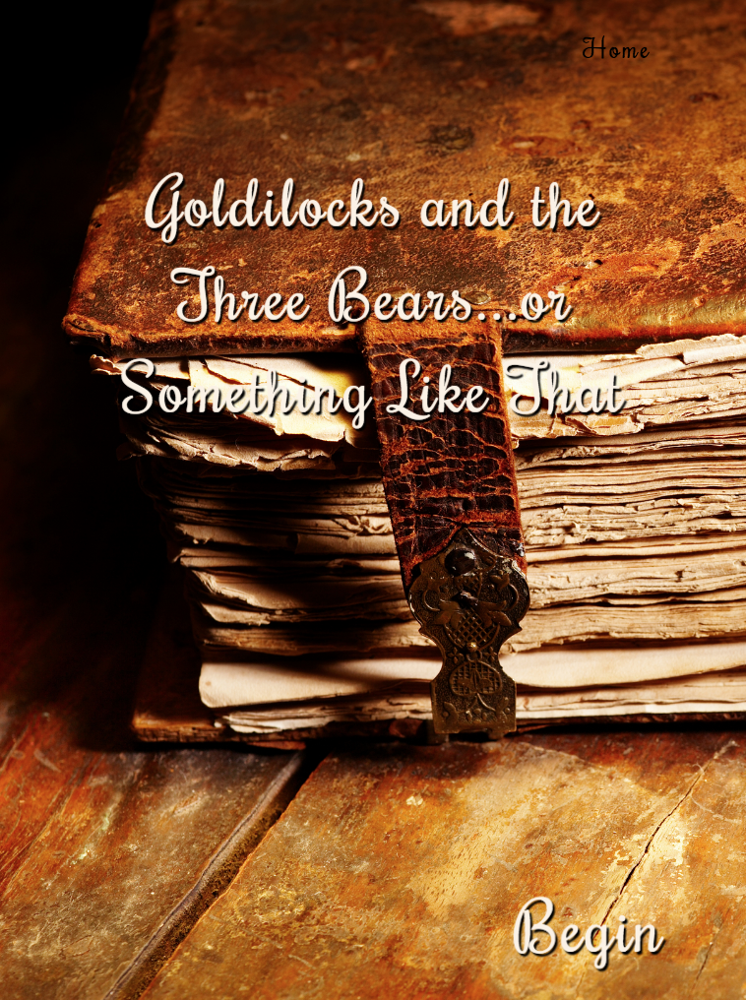
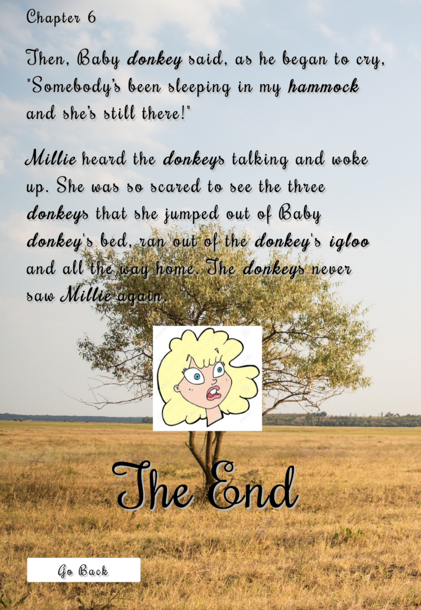
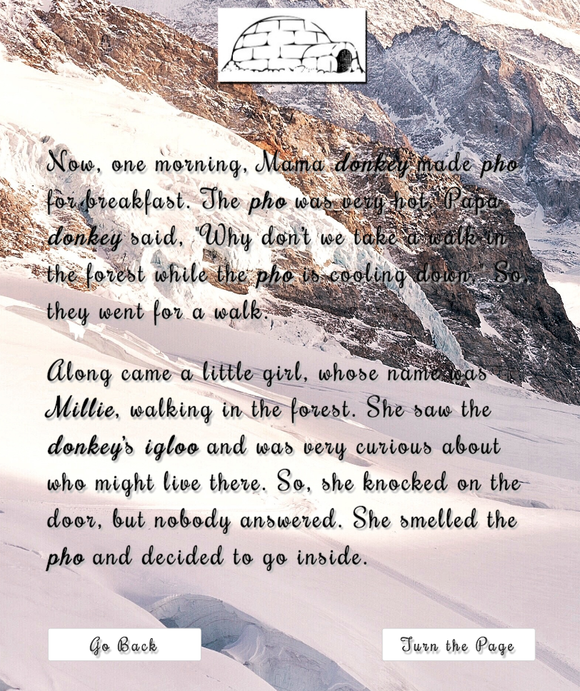
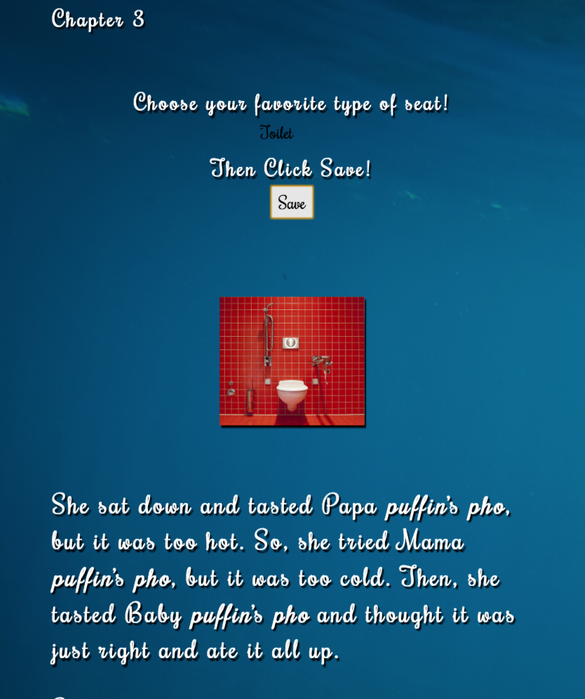
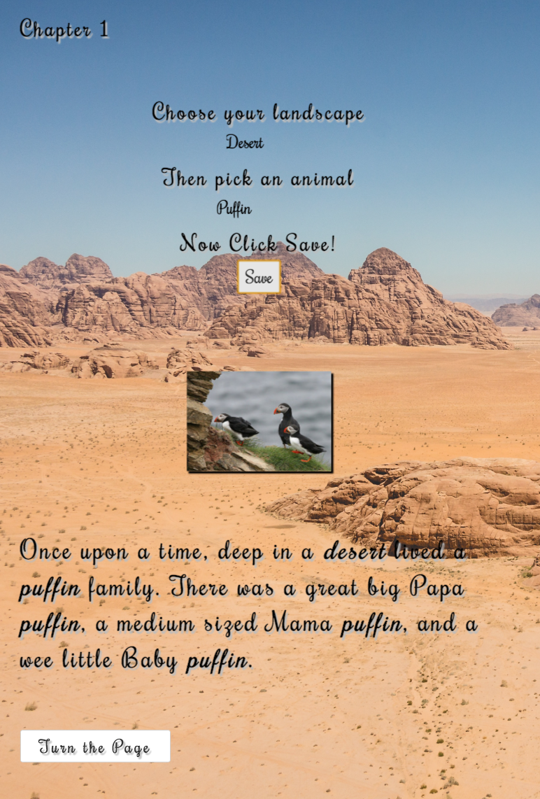

# _Goldilocks & The Three Bears...Or Something Like That_

#### _This is a Ruby on Rails and React application built with Ruby 2.4.1, Rails 5.1.2, and the React-Rails Gem.  It is an interactive storybook for children to create their own version of the classic story, Goldilocks and The Three Bears.  Because who doesn't love a good bed time story!  July 20, 2017_

#### By _**Asia Kane**_

#### View Project at: https://interactive-storybook.herokuapp.com/ 

## Description

This application is for children (or adults who are kids at heart) to create their own version of the classic children's storybook.  Each chapter allows users to submit custom information (e.g. the name of the little girl in the story) which is dynamically rendered using React components, state changes, and ajax.  Upon saving, this information is saved to the database and persisted throughout the remaining chapters.  Also included are images corresponding to user input to create the true, magical, storybook effect.  

This application was inspired by my desire to blend the technology dependent society we live in today with the enchanting, classic picture books with which so many of us grew up (and loved)!

Users can:
- Navigate through the story
- Submit custom data that is saved to the database and persisted throughout the story
- Enjoy the images that are dynamically rendered based on user input

Challenges:
- First time using React
- Learn both the basics of React and figure out how to integrate React into a Rails application at the same time

Learnings:
- The importance of creating small, compact React components and the beauty of creating reusable components
- How powerful updating a component's state can be
- The lifecycle of React components and when certain functioned are executed (e.g. componentDidMount(), etc.)
- Ease and challenges of having JS, HTML, and styling in the same file

## Prerequisites

You will need the following things properly installed on your computer.

* [Git](https://git-scm.com/)
* [Postgres](https://www.postgresql.org/)
* [Ruby 2.4.1](https://www.ruby-lang.org/en/downloads/)
* [Rails 5.1.2](http://rubyonrails.org/)

## Installation

In your terminal:
* `git clone https://github.com/akane0915/rails-interactive-storybook`
* `cd rails-interactive-storybook`
* Ensure you are running Ruby 2.4.1 and Rails 5.1.2 versions or later.
* `bundle install`
* Open another terminal window and type `postgres`.  Leave this window open.
* In your first terminal window type:
* `bundle exec rake db:setup`
* `bundle exec rake db:test:prepare`

## Development server

Run `bundle exec rails s` for a dev server. Navigate to `http://localhost:3000/`. The app will automatically reload if you change any of the source files.

* If you would like to make changes to this project, do so in a text editor.
* Make frequent commits with detailed comments.
* Submit changes as pull request to Asia at akane0915 on Github.

## Running tests

This app includes unit and integration testing using RSpec, Shouldamatchers.
Run `bundle exec rspec` in terminal to test.

## Technologies Used

* Ruby on Rails
* React
* JSX
* ActiveRecord
* Postgres
* Bundler
* Rake
* Rspec
* HTML
* SCSS
* Bootstrap
* ES6

## Known Bugs
_N/A_

#### Screen Shots

## Support and contact details
_I encourage you to update/make suggestions/refactor this code as you see fit. I am always open to improvement! Please contact Asia Kane at asialkane@gmail.com with questions._

### License
*This software is licensed under the MIT license*
Copyright © 2017 **Asia Kane**
